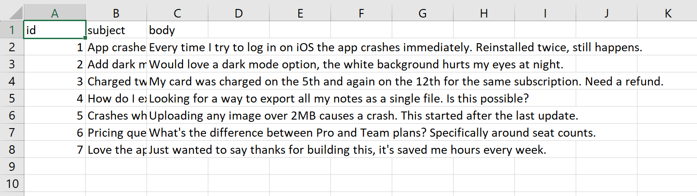
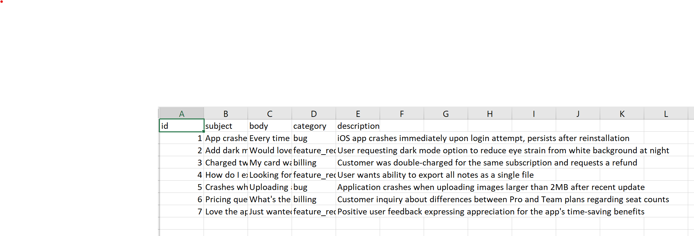

A Python CLI project that classifies customer support tickets by category and confidence using the Claude API.

How to run:
1. git clone <HTTP_URL>.
2. create a .env file in python-cli folder and paste anthropic key in below format:
ANTHROPIC_API_KEY=<<ANTHROPIC_KEY>>
3. Past your CSV in python-cli folder named as tickets.csv file.
4. in terminal run command uv run classify.py
You are all set!!

Sample Output:
A file names tickets_classified2.csv will be created, with a below sample row:
"1,App crashes on login,"Every time I try to log in on iOS the app crashes immediately. Reinstalled twice, still happens.",bug,"iOS app crashes immediately upon login attempt, persists after reinstallation"

What I learned:
1. Use of LLM model.
2. Handling of non JSON response.
3. Use of pandas library

Input file: tickets.csv

Output file: tickets_classified.csv with category and description added
